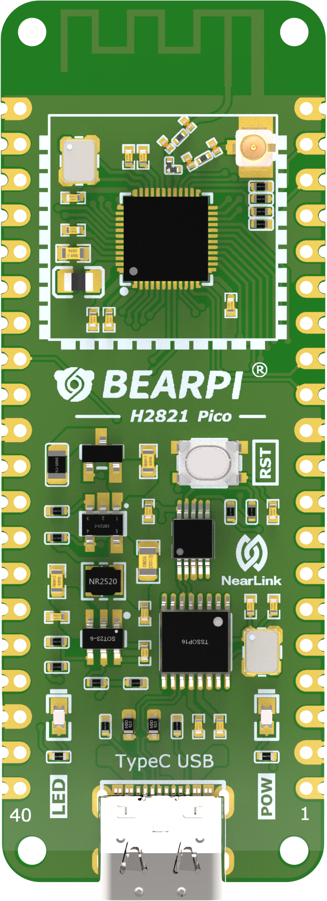
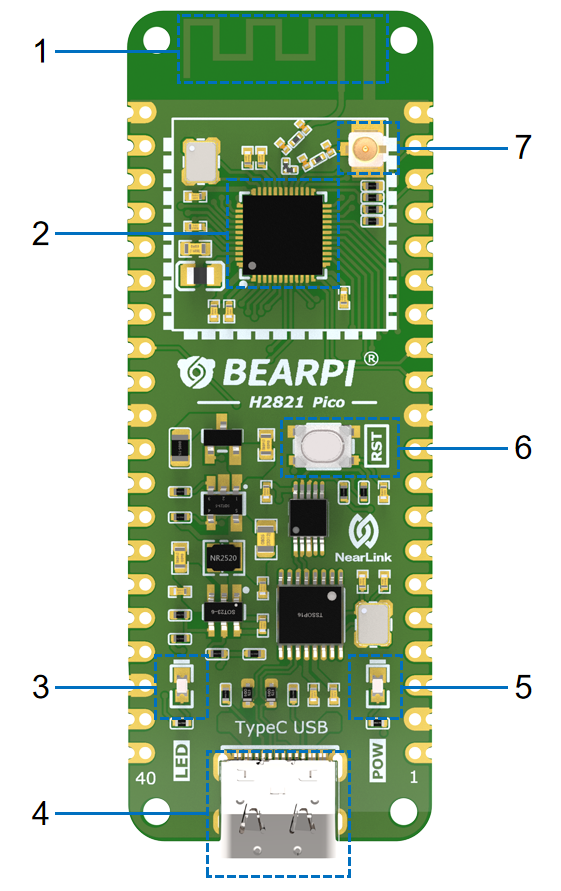

## 产品概述

BearPi-Pico H2821是一款基于高度集成 2.4GHz SoC BLE&SLE为主控芯片的核心板，具有灵活的数字接口，IO口可复用为任意功能，集成高性能 32bit 微处理器（MCU），硬件安全引擎以及丰富的外设接口，外设接口包括 SPI、UART、I2C、PWM、GPIO、USB2.0、NFC Tag、PDM、I2S/PCM、QDEC、KEYSCAN 键盘扫描电路，支持 8 路 13bit 分辨率 ADC、ADC 支持对接音频 AMIC，内置 SRAM 和合封 Flash，并支持在 Flash 上运行程序。

- 目标用户群体：初学者、企业开发者

- 购买链接：[点击进入](https://item.taobao.com/item.htm?id=633296694816)

- 开发教程：[点击进入](https://www.bearpi.cn/core_board/bearpi/pico/h2821/)

## 规格参数

<table><thead align="left"><tr id="r54b3810e43d24e1887c1d6a41394996b"><th class="cellrowborder" valign="top" width="18.02%" id="mcps1.2.3.1.1">
规格类型

</th>
<th class="cellrowborder" valign="top" width="81.98%" id="mcps1.2.3.1.2">
规格清单

</th>
</tr>
</thead>
<tbody><tr id="r71f534ea66af4191b020408df5978f41"><td class="cellrowborder" valign="top" width="18.02%" headers="mcps1.2.3.1.1 ">
通用规格

</td>
<td class="cellrowborder" valign="top" width="81.98%" headers="mcps1.2.3.1.2 "><ul id="u2a0d06f28d454d30818ced9a0432211b"><li>CPU：Hi2821 RISC-V 高性能 32bit CPU，最大主频支持 64MHz</li><li>存储：160KB SRAM，512KB Flash</li><li>主板供电：通过USB 5V供电或者外部 5V供电</li><li>LED灯：<ul id="ul0879143622219"><li>上电指示 LED，红色；</li><li>用户定义LED，蓝色;</li></ul>
</li><li>通信：SLE、BLE</li>
</ul>
</td>
</tr>

<tr id="r3563f9df9759486794952d46c5d2d03f"><td class="cellrowborder" valign="top" width="18.02%" headers="mcps1.2.3.1.1 ">
电源特性

</td>
<td class="cellrowborder" valign="top" width="81.98%" headers="mcps1.2.3.1.2 "><ul id="uca57d799e7814925a5bf1b891335bd79"><li>Typec USB接口，5V供电</li><li>内部有5V转3.3V的DCDC</li><li>MCU供电电压为3.3V，系统IO电压也为3.3V</li></ul>
</td>
</tr>

<tr id="rae93c5236b084cd2a2c0d5c29027b40e"><td class="cellrowborder" valign="top" width="18.02%" headers="mcps1.2.3.1.1 ">
外围接口

</td>
<td class="cellrowborder" valign="top" width="81.98%" headers="mcps1.2.3.1.2 "><ul id="u7c73ebffd89e4092bd65f0d878d59b22"><li>I2C*2</li><li>SPI*3</li><li>ADC*8</li><li>UART*3</li><li>PWM*6</li><li>GPIO*29</li><li>PDM*2</li><li>I2S*1</li><li>USB2.0</li><li>QDEC</li><li>KeyScan</li><li>NFC Type2 Tag</li><li>注：上述接口通过复用实现</li></ul>
</td>
</tr>

<tr id="rae93c5236b084cd2a2c0d5c29027b40e"><td class="cellrowborder" valign="top" width="18.02%" headers="mcps1.2.3.1.1 ">
其他信息

</td>
<td class="cellrowborder" valign="top" width="81.98%" headers="mcps1.2.3.1.2 "><ul id="u7c73ebffd89e4092bd65f0d878d59b22"><li>工作温度：-40℃ ～+85℃</li></ul>
</td>
</tr>
</tbody>
</table>

## 产品特点

- 板载基本电路，包括晶振电路，烧录接口，USB接口等
- 支持 BLE 和 SLE 双模共存
- RISC-V 高性能 32bit CPU，最大主频支持 64MHz，支持浮点，支持 SWD。
- 内置 160KB的SRAM和512KB的Flash。
- 支持加密：AES（Advanced Encryption Standard）、SM4 和 TRNG（True
  Random Number Generator
- 支持丰富的对外接口
  - AFE（Analog Front-End）
  - 传感器通路（General Analog Front-End）：支持 8 ch 13bit 1.6Msps
    SAR ADC，支持单端/差分/扫描模式，支持过采样和 buf 功能。
  - 音频通路（Audio Analog Front-End）：支持复用 13bit SAR ADC，降采
    样到 16ksps/8ksps；支持 40dB 倍放大。
  - 支持 2×I2C（The Inter-Integrated Circuit），可配置为 Master 和 Slave。
  - 支持 1 路 2 通道 I2S（Integrated Interchip Sound）/PCM（ Pulse Code
    Modulation）。
  - 支持 2 通道 PDM（Pulse Density Modulation）接口。
  - 支持 3×SPI（Serial Peripheral Interface），支持 master 和 slave 模式可配。
  - 支持 3×UART（Universal Asynchronous Receiver-Transmitter ），最大速率
    4Mbit/s，其中 2 个 4 线 UART。
  - 支持 6×PWM（Pulse Width Modulation）。
  - 支持 USB2.0（Universal Serial Bus），支持 FS/HS mode，最大支持
    480Mbit/s。
  - 支持 NFC Type2 Tag 功能，支持 NFC 场唤醒功能。
  - 支持 QDEC（QuaDrature EnCoding ）接口。
  - 支持 KeyScan 功能。
  - 支持 29 个 GPIO（General-Purpose Input/Output）。

## 功能接口

| 编号 | 功能            | 说明                                                                                        |
| :--- | :-------------- | :------------------------------------------------------------------------------------------ |
| 1    | 2.4G 天线       | BLE 和 SLE 天线                                                                             |
| 2    | 主控芯片 Hi2821 | RISC-V 高性能 32bit CPU，最大主频支持 64MHz，支持 BLE 和 SLE 双模共存，支持浮点，支持 SWD。 |
| 3    | 用户灯          | 蓝色 LED灯，用户可通过代码自定义控制                                                        |
| 4    | USB Typec-C     | 支持 5V USB 输入，具备调试烧录功能                                                          |
| 5    | 电源灯          | 红色电源灯，正常工作时常亮                                                                  |
| 6    | Reset Key       | 复位按键，可通过该按键复位开发板                                                            |
| 7    | IPX 天线座      | IPX 天线座 可用于外接天线，使用前需要调整天线电阻                                           |

